# 【2024-RSOC】从零开始制作基于星火一号的电机控制驱动 #

**【2024-RSOC】** 基于RT-Thread官方开发板星火一号，参考RT-Thread入门pdf资料，和夏令营老师的讲解，编写而成。本内容面向小白，因为写这个的作者也是小白，跟着夏令营刚开始学rtt，欸嘿（笑）。

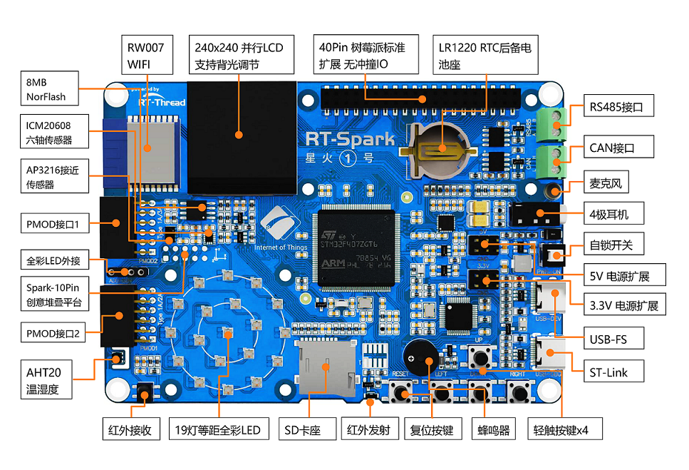
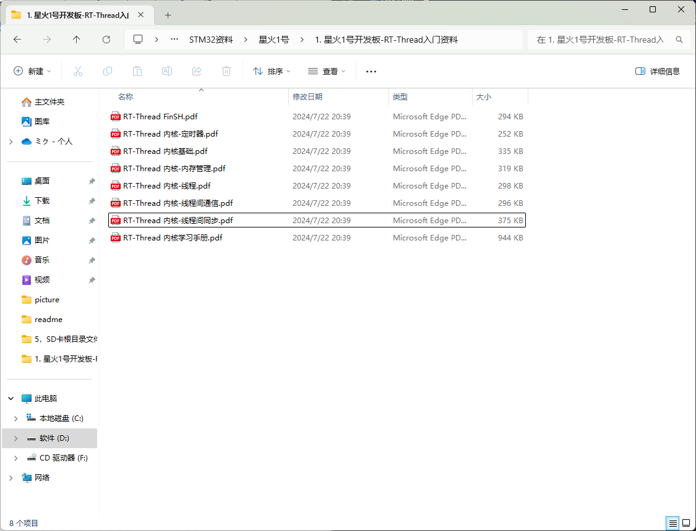

[在线文档♥点♥我♥看♥](hhttps://www.rt-thread.org/document/site/#/rt-thread-version/rt-thread-standard/programming-manual/filesystem/filesystem)

如果初次使用spark的bsp软件包，未构建vscode文件，则参考我前日发布[【2024-RSOC】夏令营Day2：初识rt-thread及多线程简单试用](https://club.rt-thread.org/ask/article/9da7f2983ce3264f.html)中的`初次搞机（干通官方bsp源码）`小节，确保工程文件能正常打开烧录例程，再往下进行。

## 项目简介 ##
写一个多电机驱动，想挂几个挂几个的那种。只要不在意处理延时，只要你通道数量够，你想挂几个挂几个，然后整个smartcar文件夹，挪到别的工程只需改头文件预设值，照样能用。

Q：为啥不玩rtt的高端组件和应用嘞？

A：俺是村里干硬件画板子焊板子写驱动出身滴，比较高端的组合功能有俺们编程部顶着哩！

然后用某宝最垃圾的车架和驱动器，做一个能够巡线的小车（悲），主打一个该省省该花花。

## 硬件选择 ##

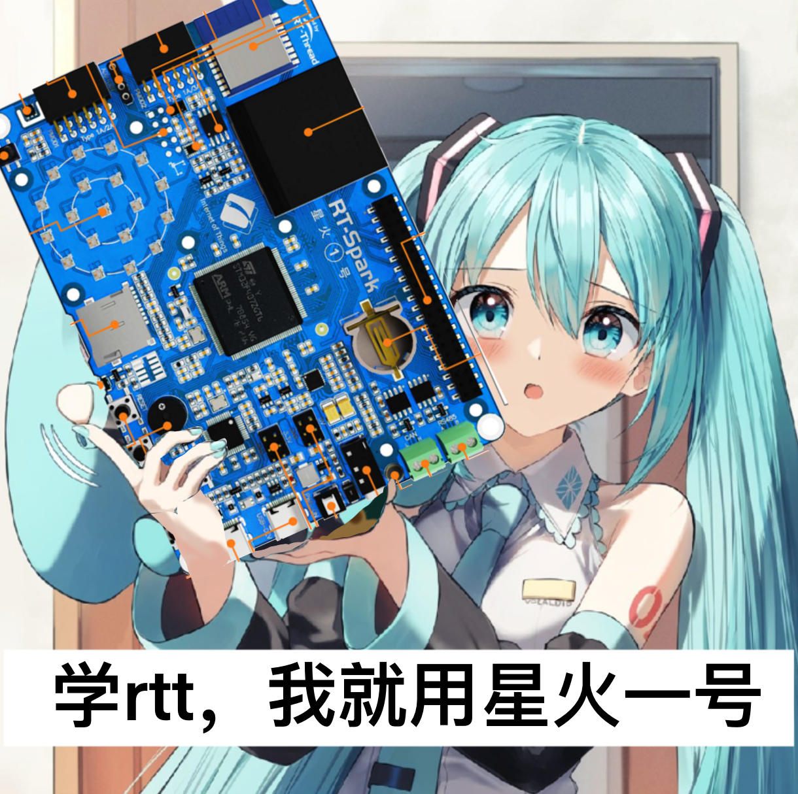

学RTT，我选星火一号（笑）
做一辆能实现基本功能的巡线小车，车架和光感，怎么便宜怎么来，看我截图，就是这个价格，他们还包邮我哭死。**如果你没有连接用的铜柱和螺丝还有杜邦线，请一定自行找链接购买**

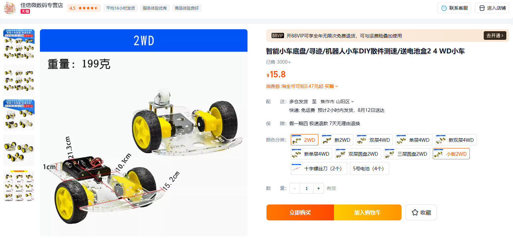
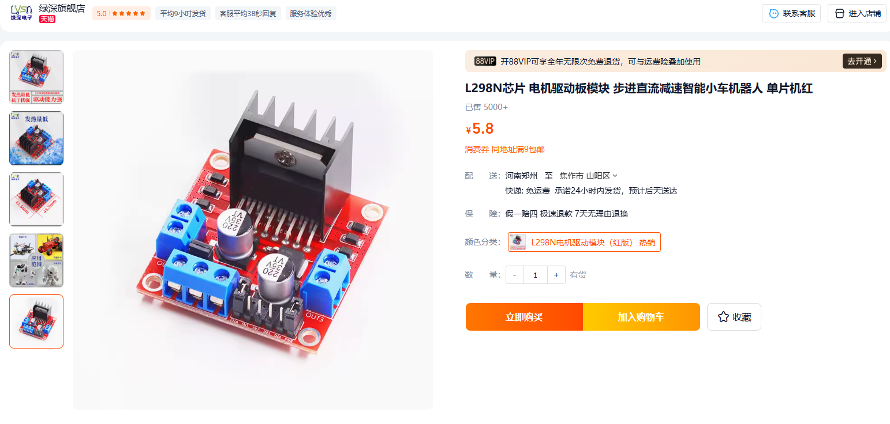
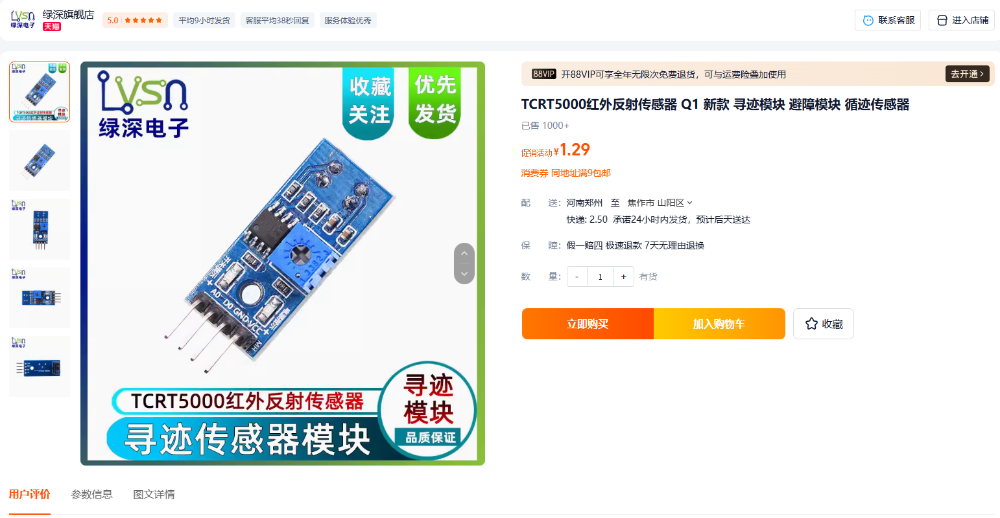

到手后组装车架，效果如图


车架搞好了，那就可以开始设计驱动了

## 驱动设计阶段 ##

LN298N是一个双电机驱动器。关于这个模块，我们有几种用法。我们首先看下这个模块的设计

 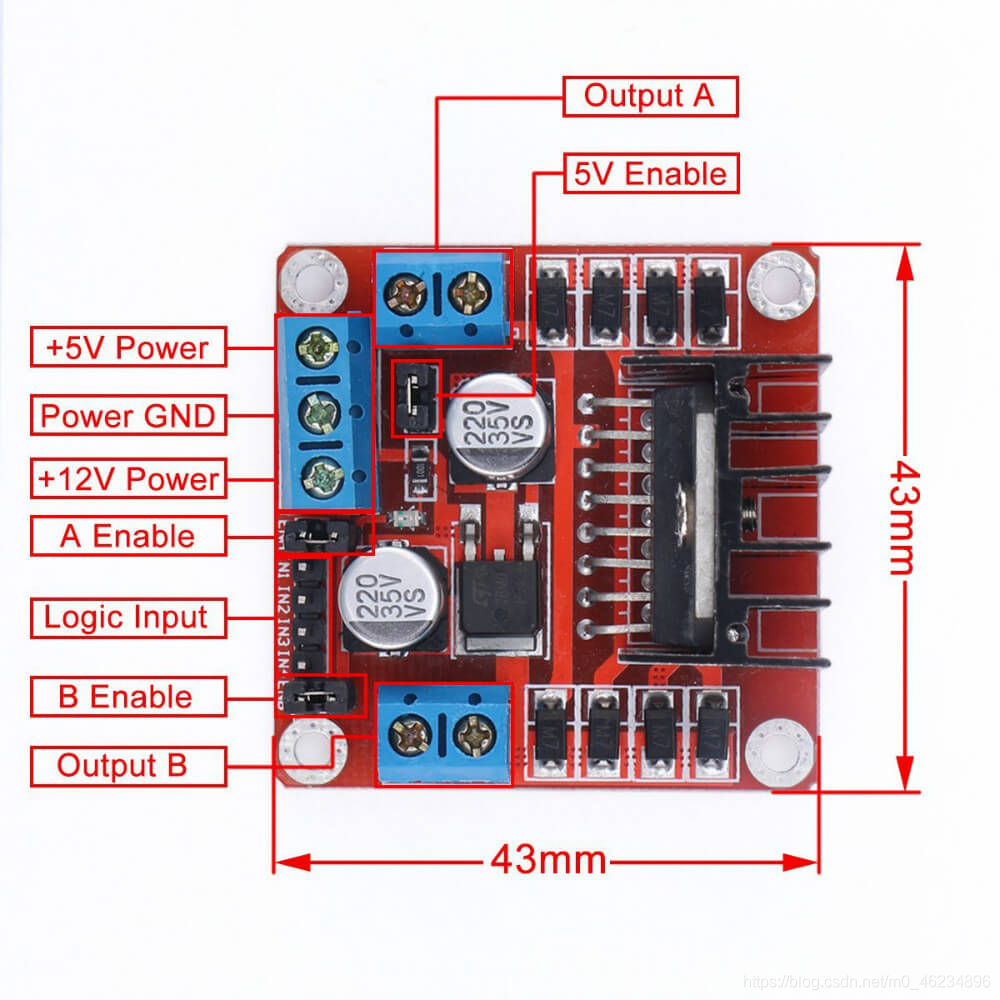

**！！！这个图片的12V输入和5V输入标反了！！！具体一定看你买的的298N的标注**

12V是电源输入，咱们选购的车架是带有四节干电池串联座的。但是干电池，可以用但不好用，所以我做了外接12V的DC接口，直接用稳压电源输入电源，就是试车的时候会变成天线宝宝，拖根大电线。使用干电池的电压也就6V多一点，由于本身内阻大出现的症状包括但不限于：PWM给低时电机萎靡不振，或者跑五分钟就肾虚，电机堵转时开发板掉电重启（因为撑不住）。两节18650串联就不会有这些问题。当然网上是卖有18650串联电池座的，但两节18650带上充电器就得六十块钱了，我肯定是不会花这个钱的。还有就是万用表里的9v电池，大方疙瘩，那个都比四节干电池劲大，毕竟9V力大飞砖。

5V是给单片机供电用的，不多解释，把5V和GND接到SPARK开发板的5V拓展电源PIN输入上为板子供电。

IN1-IN4四个通道，以及旁边的两个enable跳帽，控制两个OUT口的输出。跳帽将A enable和B enable跳到5V，使之一直为开启状态。

第一种用法，保留两个通道的跳帽，使两个通道一直为开启状态。设置连接IN1-IN4四个通道的单片机引脚为GPIO输出模式，通过控制IN1-IN4四个通道的引脚电平，来控制小车方向。IN1-IN4四个通道控制表如下图所示

 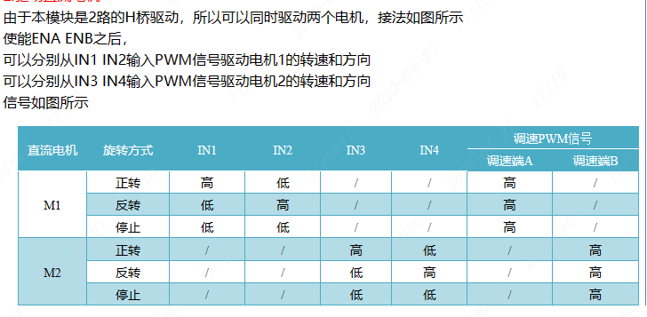

由于我们保留跳帽，使两个通道一直开启，电机就会慢速转动。如果我们要在这种模式下改变速度，就需要将连接IN1-IN4四个通道的单片机引脚全部改为TIMx_CHx的模式来输出PWM，使用输出比较模式改变PWM占空比来控制通道的速度。这种方法占用四个GPIO或者四个PWM通道，适合初学者裸机开发使用。

第二种方法，则是将单片机上两个引脚输出PWM，分别连接至A B enable这两个接口，起到油门的作用。而IN1-IN4四个通道依旧占用4个GPIO。这样总共占用6个接口。

我们选用第二种方法来控制电机。

为什么占用多了我们反而要使用第二种呢？因为第二种更合适做电机驱动的框架，讲人话就是更合理。我们给电机建立一个模型，对以一个电机硬件系统而言，无非就是方向和速度（油门）这俩。控制一个电机，我们只要给出这俩信息给电机控制器就行了，占用IO多是298N的问题。我们给IN1-IN4挂载一个二选一数据选择器，就只需要给两根GPIO就能解决方向问题，所以说对于控制框架而言，第二种更合适。

我们先考虑控制一路电机需要做哪些工作。我们首先要对设备初始化，初始化包括将电机模型数据初始化，控制用的引脚初始化。然后我们给电机一个方向要让电机往某个方向走，然后我们要让他转起来，就需要给他一个速度数据。如果我们需要闭环控制固定的速度，就需要额外引用一个PID控制包，将编码器的反馈值交给PID包计算，将油门量交给PID数据包计算。这个数据包实际就是PID函数，我们直接可以用网上别人写的现成的，毕竟和自己写的也一样，没啥必要自己写。

这样的话，流程就是：`初始化->接收数据改方向->接收数据改速度`，此后便是不断的：`接收数据改方向->接收数据改速度`

如果有两套电机，我们如果还按照上面这个思路，我们就得写两套`初始化->接收数据改方向->接收数据改速度`的代码来分别控制。也就是每一个函数都要写个一号二号，这无疑是增大了工作量。如果加一套电机就要加一套函数就太恶心人了。

```
初始化函数           方向控制函数             速度控制函数
———————————————     ——————————————————      ——————————————————
|电机1初始化函数|    |电机1接收数据改方向|    |电机1接收数据改速度|
|电机2初始化函数| -> |电机2接收数据改方向| -> |电机2接收数据改速度|
|     ···      |    |       ···       |    |       ···        |
———————————————     ——————————————————      ——————————————————

加一套电机就要多一个函数，麻烦

```

那么电机控制的流程都是一致的，可不可以我们只用一套控制函数，去控制多个电机呢？我们该怎样让这一套控制流程在某个时刻来控制某个电机呢？上边我们写的框架中，电机1系列的函数和电机2系列的函数，我们肯定会对指定电机的参数进行操作，其余部分完全一致。那么我们把电机参数和控制流程分离开，控制流程接受某个电机的参数，进而只控制该电机，需要切换电机就切换到对应电机参数进行操作，这样，一套流程，我们可以快速修改代码挂载多个电机，同时在需要的情况下，也能对某些电机做单独的参数调整或者校准。肥肠的方便。

```

参数定义部分
———————————————     —————————————     —————————————
|电机1参数配置  |    |电机2参数配置|    |电机3参数配置| ···
———————————————     —————————————     —————————————

执行部分：

//挂载电机参数   //初始化函数    //方向控制函数      //速度控制函数
———————————     ———————————     ——————————————     ——————————————
| 挂载电机x | -> |初始化函数| -> |接收数据改方向| -> |接收数据改速度|
———————————     ———————————     ——————————————     ——————————————

加一套电机就加一组电机预设配置硬件通道和单个的电机数据

```


## 在rtt内使用片上外设功能 ##

控制pwm输出我们需要走单片机的TIM通道，我们需要选好合适的管脚。

星火一号给了正面40PIN的GPIO排座，欸我就是不用，我就用侧面这俩PMOD

PMOD管脚默认分配如下：

 | MODE        |    GPIOS    |    GPIOS    | MODE        |
 | :---------: | :---------: | :---------: | :---------: |
 | ADC3_IN14   | PF4         | PD12        |  TIM4_CH1   |
 | ADC3_IN15   | PF5         | PB11        |  TIM2_CH4   |
 | ADC3_IN5    | PF6         | PB10        |  TIM2_CH3   |
 | ADC3_IN5    | PF7         | PD11        |             |

 | MODE        |    GPIOS    |    GPIOS    | MODE        |
 | :---------: | :---------: | :---------: | :---------: |
 |             | PE4         | PA5         |             |
 |             | PE3         | PA6         |             |
 |             | PE5         | PA7         | TIM3_CH2    |
 |             | PE2         | PA4         | AC_OUT1     |

我们选取TIM2_CH4和TIM2_CH3作为输出，但是LN298N的通道还要占用4个GPIO，光感也需要占用俩GPIO，在官方的BSP包内是没有配置该GPIO的。需要我们手动开启。


 我们选择PE2，PE5，PE3，PE4依次分别作为ln298n的四个通道的输入，PA5，PA6设置为光感的接口（配图显示的引脚编号有误），这六个口均设置成输出的GPIO_output，并且点击图中位置，四个通道配置为下拉模式即可。

 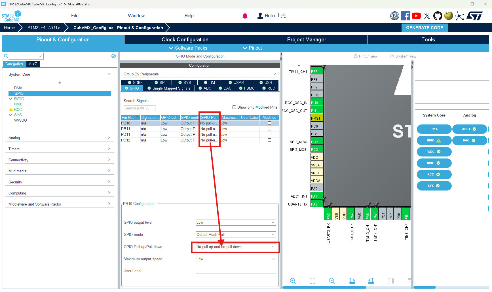
 
 然后在这个页面，我们取消勾选这个选项，让初始化代码只在msp文件内生成。

 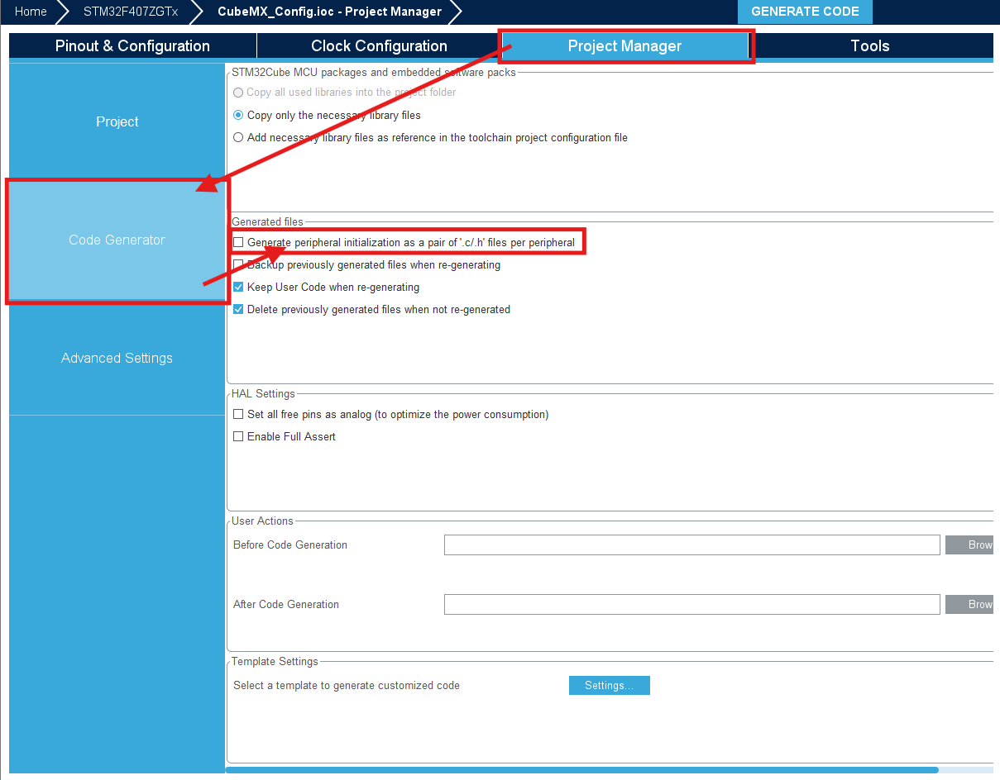

 点击GENERATE CODE，生成代码。

 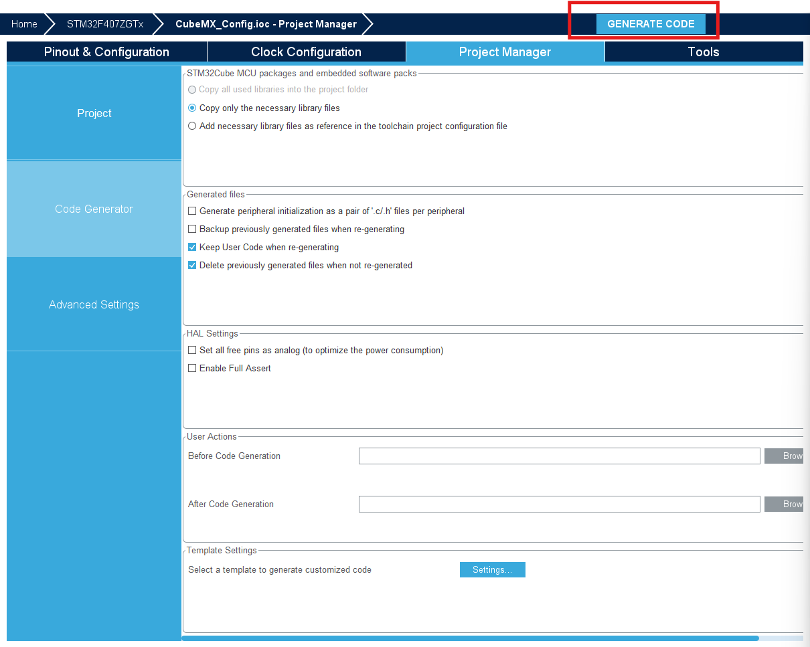

 生成代码后，MX会在CubeMX_Config目录内生成Core和Drivers文件夹，我们进入Core/Src内找到下图两个文件。

  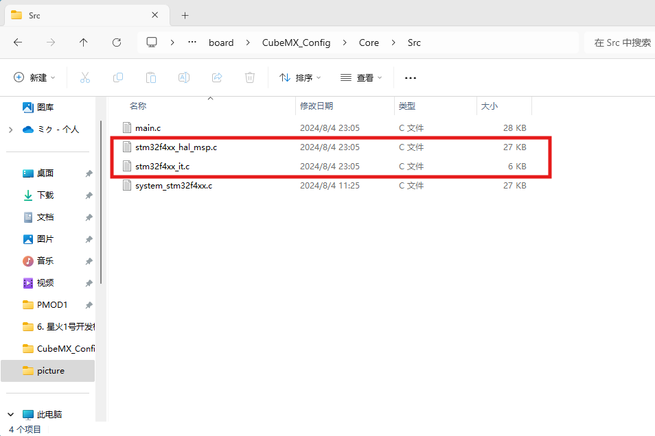

 剪切然后到CubeMX_Config/Src目录下替换。然后将Core和Drivers文件夹直接删掉就行，因为RTThread的引脚初始化只用到了这俩文件。

 在msp文件内，仅仅是对对应功能的管脚开启了总线时钟和预设了基本模式。如果我们不去cubemx里分配管脚模式，调用rtt的管脚驱动时，会没有输出。因为rtt的drv驱动只会开启相应的ip控制器，并没有打通gpio的输入输出。额外补充一点，Kconfig内的选项是开启drv驱动里面预先写好的功能，也无法控制管脚模式。所以如果不想自己写HAL代码，就用CubeMX去做管脚的初始分配。

 | MODE        |    GPIOS    |    GPIOS    | MODE        |
 | :---------: | :---------: | :---------: | :---------: |
 | ADC3_IN14   | PF4         | PD12        |  TIM4_CH1   |
 | ADC3_IN15   | PF5         | PB11        |  TIM2_CH4   |
 | ADC3_IN5    | PF6         | PB10        |  TIM2_CH3   |
 | ADC3_IN5    | PF7         | PD11        |             |

 | MODE        |    GPIOS    |    GPIOS    | MODE        |
 | :---------: | :---------: | :---------: | :---------: |
 | channel_4   | PE4         | PA5         | 光感右侧     |
 | channel_3   | PE3         | PA6         | 光感左侧     |
 | channel_2   | PE5         | PA7         | TIM3_CH2    |
 | channel_1   | PE2         | PA4         |             |


 
 
 
 管脚分配结束，接下来要配置kconfig，kconfig的用法看我前几篇文章，这里不再赘述。在kconfig内找到PWM功能，开启PWM2的通道3和4，对应我们选择的TIM2_CH3和TIM2_CH4。

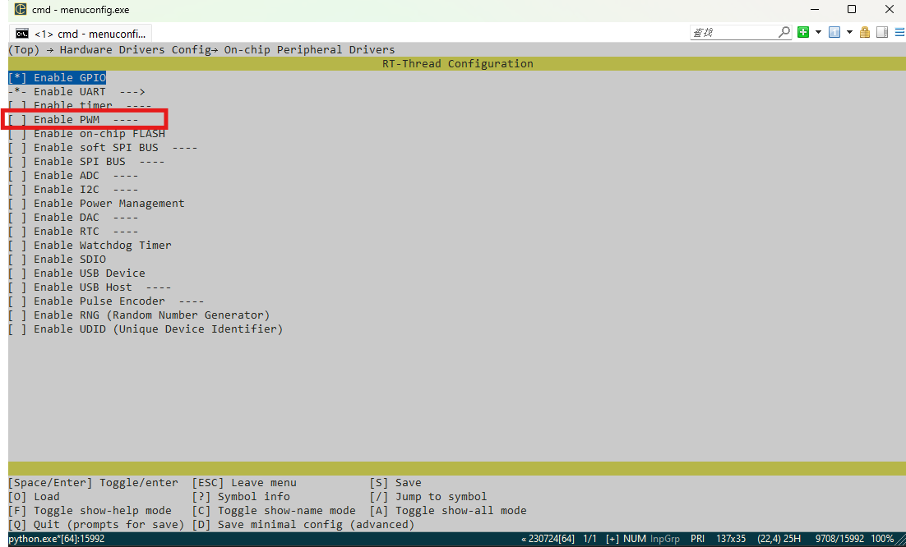
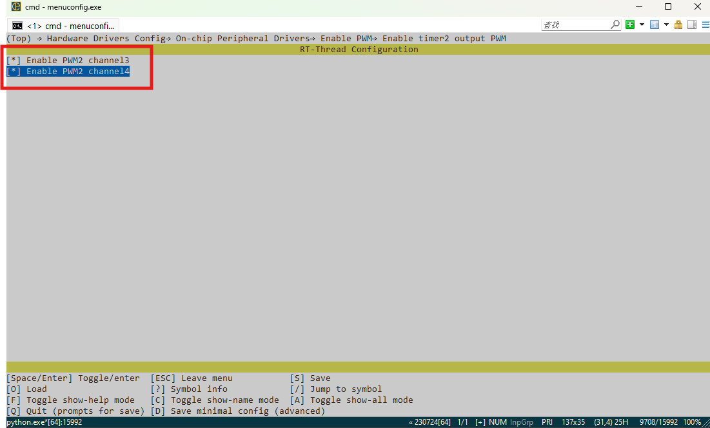

接下来我们可以写代码了。


## 代码部分 ##

我们使用的rtthread，已经提供出操作外设的接口。我们使用的pwm不需要我们对通道在写初始化引脚的代码了。所以电机初始化阶段，我们做的就是状态初始化。

使用pwm，可以参考官方文档[PWM操作](https://www.rt-thread.org/document/site/#/rt-thread-version/rt-thread-standard/programming-manual/device/pwm/pwm)内介绍的接口。

所以我们写一段初始化代码

```

#define PWM_Period          500000                //PWM周期

//通道电控初始化
void MOTORINIT(const char* dev,uint8_t channel,signed int pulse)
{
     //查找pwm设备
    pwm_dev = (struct rt_device_pwm *)rt_device_find(dev);
    if (pwm_dev == RT_NULL)
    {
        rt_kprintf("pwm sample run failed! can't find %s device!\n", dev);   
    }

    // 设置PWM周期和脉冲宽度默认值 
    rt_pwm_set(pwm_dev, channel, PWM_Period, pulse);
    // 使能pwm设备 
    rt_pwm_enable(pwm_dev, channel);   
}


```
这时还仅有一个电机，输入的量就有三个，那怎么办？

按照我们构建的框架，一套电机对应一套参数，这三个，毫无疑问就是一个电机的信息。显而易见，我们使用结构体会很方便使用和管理。

那我们写一段结构体

```

//设备控制结构体
typedef struct
{
    const char* dev;                //pwm设备
    uint8_t channel;                //通道
    signed int pulse;               //脉宽数据

}OUTSTRUCT;
extern OUTSTRUCT outstruct;

```
这个结构体目前包含了我们初始化点击要用到的参数，那么输入的参数，我们直接使用结构体即可。初始化函数我们就可以改为

```
void MOTORINIT(OUTSTRUCT *p)
{
    //查找pwm设备
    pwm_dev = (struct rt_device_pwm *)rt_device_find(p->dev);
    if (pwm_dev == RT_NULL)
    {
        rt_kprintf("pwm sample run failed! can't find %s device!\n", p->dev);   
    }
    
    // 设置PWM周期和脉冲宽度默认值 
    rt_pwm_set(pwm_dev, p->channel, PWM_Period, p->pulse);
    // 使能pwm设备 
    rt_pwm_enable(pwm_dev, p->channel);
}

```

可是，这一套结构体只能保存一个电机的数据，如果我们要控制多个电机，就得需要这结构体的变量要变成别的电机的量。别的电机的量怎样挂载到我们的初始化代码呢？

给电机们专门建立各自的结构体存放信息，让初始化代码使用的结构体变为暂存器，使用时暂存器挂载对应结构体的值不就可以了吗？

所以我们这样写结构体：

```


//设备2数据保存结构体
typedef struct
{
    const char* out2_dev;                //pwm设备
    uint8_t out2_channel;                //通道
    signed int out2_pulse;               //脉宽数据

}OUT2STRUCT;
extern OUT2STRUCT out2struct;

//设备3数据保存结构体
typedef struct
{
    const char* out3_dev;                //pwm设备
    uint8_t out3_channel;                //通道
    signed int out3_pulse;               //脉宽数据

}OUT3STRUCT;
extern OUT3STRUCT out3struct;

//设备控制结构体
typedef struct
{
    const char* dev;                //pwm设备
    uint8_t channel;                //通道
    signed int pulse;               //脉宽数据

}OUTSTRUCT;
extern OUTSTRUCT outstruct;


```

我们这样写初始化

```
#define OUT2_SIGNAL         1                    /* 电机2识别号 */
#define OUT3_SIGNAL         2                    /* 电机3识别号 */

#define PWM_Period          500000                //PWM周期

//通道参数初始化
void STRUCT(uint8_t s)
{
     if (s==OUT2_SIGNAL)
     {
        //电机2设备数据结构体初始化
        out2struct.out2_dev=OUT2_DEV;
        out2struct.out2_channel=OUT2_CHANNEL;
        out2struct.out2_pulse=0;
     }

     if (s==OUT3_SIGNAL)
     {
        //电机3设备数据结构体初始化
        out3struct.out3_dev=OUT3_DEV;
        out3struct.out3_channel=OUT3_CHANNEL;
        out3struct.out3_pulse=0;
     }
}

//通道电控初始化
void MOTORINIT(uint8_t s,OUTSTRUCT *p)
{

    DATASW(s,p);//识别电机通道切换对应数据

    //查找pwm设备
    pwm_dev = (struct rt_device_pwm *)rt_device_find(p->dev);
    if (pwm_dev == RT_NULL)
    {
        rt_kprintf("pwm sample run failed! can't find %s device!\n", p->dev);   
    }
    
    // 设置PWM周期和脉冲宽度默认值 
    rt_pwm_set(pwm_dev, p->channel, PWM_Period, p->pulse);
    // 使能pwm设备 
    rt_pwm_enable(pwm_dev, p->channel);

}
```
我们将电机设备定义一个编号，初始化参数和电机都只看设备，初始化电机时，需要识别设备编号，然后出现了一个`DATASW(s,p);`，这个就是将暂存结构体数据切换到对应通道数据的函数。我们怎么编写他呢？


```
void DATASW(uint8_t s,OUTSTRUCT *p)
{
   if (s==OUT2_SIGNAL)
   {
    p->dev=out2struct.out2_dev;
    p->channel=out2struct.out2_channel;
    p->pulse=out2struct.out2_pulse;

   }
    if (s==OUT3_SIGNAL)
   {
    p->dev=out3struct.out3_dev;
    p->channel=out3struct.out3_channel;
    p->pulse=out3struct.out3_pulse;
   }   
}
```

我们用了笨办法，一个一个赋值，毕竟我C语言也不是那么好，memcpy也应该可以用，并且添加新设备时会很快，我就不用了。

接下来我们写速度设置代码。
```
#define MOTOR_PWM_MAX   	400000		          //禁止满占空比输出，造成MOS损坏
#define MOTOR_PWM_MIN	   -400000		          //


//速度设定
void SETSPEED(uint8_t s,OUTSTRUCT *p)
{
    DATASW(s,&outstruct);//识别电机通道切换对应数据
     /* 查找设备 */
    pwm_dev = (struct rt_device_pwm *)rt_device_find(p->dev);

    p->pulse = -(p->pulse);//参数反转
    if (p->pulse>=0)
    {
        p->dir=FORWARD;
        DIRSW(&outstruct);
        if (p->pulse>MOTOR_PWM_MAX)
        {
             p->pulse = MOTOR_PWM_MAX;
        }
        rt_pwm_set(pwm_dev, p->channel, PWM_Period, p->pulse);
        
    }
    else if (p->pulse<0)
    {
        p->dir=BACKWARD;
        DIRSW(&outstruct);
        if (p->pulse<MOTOR_PWM_MIN)
        {
             p->pulse = MOTOR_PWM_MIN;
        }
        p->pulse = -(p->pulse);
        rt_pwm_set(pwm_dev, p->channel, PWM_Period, p->pulse);
        
    }
    
}
```

拓展一下，如果在设置速度前，我们闭环控制得到某个通道电机的pulse值，这个pulse是我们希望更新到电机上的，我们写一个闭环函数来看一下

```
//闭环速度控制
void CONTROLLOOP(uint8_t s,OUTSTRUCT *p,float speed)
{
    rt_int32_t encounter;
    float SpeedFeedback;
    DATASW(s,p);//识别电机通道切换对应数据

   
    //闭环编码器采样段（这里只是示例，本此实验车架并不支持闭环控制，这段开了会报错，因为没开对应硬件设置）
    pulse_encoder_dev = rt_device_find(p->enc);
    rt_device_read(pulse_encoder_dev, 0, &encounter, 1);//脉冲计数器采样
    rt_device_control(pulse_encoder_dev, PULSE_ENCODER_CMD_CLEAR_COUNT, RT_NULL);
    
    pidStr.vi_FeedBack=encounter;
    SpeedFeedback=(float)(encounter * PI * DiameterWheel)/ MOTOR_CONTROL_CYCLE / EncoderLine / 2.0f / ReductionRatio; //  m/s
    

    rt_kprintf("speed is %2f\n", SpeedFeedback);

    if(speed > MOTOR_SPEED_MAX)
        speed = MOTOR_SPEED_MAX;   
    else if(speed < -MOTOR_SPEED_MAX)
        speed = -MOTOR_SPEED_MAX;

    pidStr.vi_Ref = (float)(speed*MOTOR_CONTROL_CYCLE / DiameterWheel / PI * EncoderLine * 2.0f * ReductionRatio);
    
    p->pulse=PID_MoveCalculate(&pidStr);

    //不对劲
    SETSPEED(s,p);
}
```
看到不对劲了吗？我们思考下流程，闭环控制给出对应电机的pulse的值，我们的设置速度的函数紧跟上去，看似没有问题。实际上在速度设置函数，我们为了让这个函数单独拿出来能用，加了一个数据选择器`DATASW(s,&outstruct);`，闭环出来的pulse，他还在缓存结构体里，立马就被速度设置函数重新选择通道的操作给覆盖了。


也就是说我们要让闭环出来的pulse，及时更新到对应通道里，我们来写一个保存数据的函数吧：

```

//结构体通道保存器 
void DATASAVE(uint8_t s,OUTSTRUCT *p)
{
   if (s==OUT2_SIGNAL)
   {
    out2struct.out2_pulse=p->pulse;

   }
    if (s==OUT3_SIGNAL)
   {
    out3struct.out3_pulse=p->pulse;
   }   
}
```

再把这个函数添加到刚刚不对劲的地方，就可以保证数据不丢失了。


这样一个基本的框架就出来了

```

//设备2数据保存结构体
typedef struct
{
    const char* out2_dev;                //pwm设备
    uint8_t out2_channel;                //通道
    signed int out2_pulse;               //脉宽数据

}OUT2STRUCT;
extern OUT2STRUCT out2struct;

//设备3数据保存结构体
typedef struct
{
    const char* out3_dev;                //pwm设备
    uint8_t out3_channel;                //通道
    signed int out3_pulse;               //脉宽数据

}OUT3STRUCT;
extern OUT3STRUCT out3struct;

//设备控制结构体
typedef struct
{
    const char* dev;                //pwm设备
    uint8_t channel;                //通道
    signed int pulse;               //脉宽数据

}OUTSTRUCT;
extern OUTSTRUCT outstruct;

#define MOTOR_PWM_MAX   	400000		          //禁止满占空比输出，造成MOS损坏
#define MOTOR_PWM_MIN	   -400000		          //

#define OUT2_SIGNAL         1                    /* 电机2识别号 */
#define OUT3_SIGNAL         2                    /* 电机3识别号 */

#define PWM_Period          500000                //PWM周期


//结构体通道选择器 
void DATASW(uint8_t s,OUTSTRUCT *p)
{
   if (s==OUT2_SIGNAL)
   {
    p->dev=out2struct.out2_dev;
    p->channel=out2struct.out2_channel;
    p->pulse=out2struct.out2_pulse;

   }
    if (s==OUT3_SIGNAL)
   {
    p->dev=out3struct.out3_dev;
    p->channel=out3struct.out3_channel;
    p->pulse=out3struct.out3_pulse;
   }   
}

//结构体通道保存器 
void DATASAVE(uint8_t s,OUTSTRUCT *p)
{
   if (s==OUT2_SIGNAL)
   {
    out2struct.out2_pulse=p->pulse;

   }
    if (s==OUT3_SIGNAL)
   {
    out3struct.out3_pulse=p->pulse;
   }   
}

//通道参数初始化
void STRUCT(uint8_t s)
{
     if (s==OUT2_SIGNAL)
     {
        //电机2设备数据结构体初始化
        out2struct.out2_dev=OUT2_DEV;
        out2struct.out2_channel=OUT2_CHANNEL;
        out2struct.out2_pulse=0;
     }

     if (s==OUT3_SIGNAL)
     {
        //电机3设备数据结构体初始化
        out3struct.out3_dev=OUT3_DEV;
        out3struct.out3_channel=OUT3_CHANNEL;
        out3struct.out3_pulse=0;
     }
}

//通道电控初始化
void MOTORINIT(uint8_t s,OUTSTRUCT *p)
{

    DATASW(s,p);//识别电机通道切换对应数据

    //查找pwm设备
    pwm_dev = (struct rt_device_pwm *)rt_device_find(p->dev);
    if (pwm_dev == RT_NULL)
    {
        rt_kprintf("pwm sample run failed! can't find %s device!\n", p->dev);   
    }
    
    // 设置PWM周期和脉冲宽度默认值 
    rt_pwm_set(pwm_dev, p->channel, PWM_Period, p->pulse);
    // 使能pwm设备 
    rt_pwm_enable(pwm_dev, p->channel);

}


//速度设定
void SETSPEED(uint8_t s,OUTSTRUCT *p)
{
    DATASW(s,&outstruct);//识别电机通道切换对应数据
     /* 查找设备 */
    pwm_dev = (struct rt_device_pwm *)rt_device_find(p->dev);

    p->pulse = -(p->pulse);//参数反转
    if (p->pulse>=0)
    {
        p->dir=FORWARD;
        DIRSW(&outstruct);
        if (p->pulse>MOTOR_PWM_MAX)
        {
             p->pulse = MOTOR_PWM_MAX;
        }
        rt_pwm_set(pwm_dev, p->channel, PWM_Period, p->pulse);
        
    }
    else if (p->pulse<0)
    {
        p->dir=BACKWARD;
        DIRSW(&outstruct);
        if (p->pulse<MOTOR_PWM_MIN)
        {
             p->pulse = MOTOR_PWM_MIN;
        }
        p->pulse = -(p->pulse);
        rt_pwm_set(pwm_dev, p->channel, PWM_Period, p->pulse);
        
    }
    
}

//闭环速度控制
void CONTROLLOOP(uint8_t s,OUTSTRUCT *p,float speed)
{
    rt_int32_t encounter;
    float SpeedFeedback;
    DATASW(s,p);//识别电机通道切换对应数据

   
    //闭环编码器采样段（这里只是示例，本此实验车架并不支持闭环控制，这段开了会报错，因为没开对应硬件设置）
    pulse_encoder_dev = rt_device_find(p->enc);
    rt_device_read(pulse_encoder_dev, 0, &encounter, 1);//脉冲计数器采样
    rt_device_control(pulse_encoder_dev, PULSE_ENCODER_CMD_CLEAR_COUNT, RT_NULL);
    
    pidStr.vi_FeedBack=encounter;
    SpeedFeedback=(float)(encounter * PI * DiameterWheel)/ MOTOR_CONTROL_CYCLE / EncoderLine / 2.0f / ReductionRatio; //  m/s
    

    rt_kprintf("speed is %2f\n", SpeedFeedback);

    if(speed > MOTOR_SPEED_MAX)
        speed = MOTOR_SPEED_MAX;   
    else if(speed < -MOTOR_SPEED_MAX)
        speed = -MOTOR_SPEED_MAX;

    pidStr.vi_Ref = (float)(speed*MOTOR_CONTROL_CYCLE / DiameterWheel / PI * EncoderLine * 2.0f * ReductionRatio);
    
    p->pulse=PID_MoveCalculate(&pidStr);

    DATASAVE(s,&outstruct);
    SETSPEED(s,p);
}


```

至此，一个粗糙的框架初见端倪，此时我们的298n的方向驱动还没有加入呢，就有些凌乱了，我们把创建一个头文件，将结构体配置和宏定义扔进去，会显得干净很多。
接下来的代码过程就不再赘述，我们可以直接看成品：

头文件`smartconfig.h`如下：
```
#ifndef __SMARTCONFIG_H
#define __SMARTCONFIG_H


#include <board.h>
#include <rtthread.h>
#include <drv_gpio.h>
#ifndef RT_USING_NANO
#include <rtdevice.h>
#endif /* RT_USING_NANO */

#include "drv_config.h"
#include "drv_tim.h"

#include <drivers/rt_drv_pwm.h>


#include <stdio.h>
#include <stdlib.h>
#include <stdbool.h>
#include <math.h>
#include <pid.h>

 /*--------------------------------------- POMD引脚配置情况 -----------------------------------------------*/
//
//                        | MODE        |    GPIOS    |    GPIOS    | MODE        |   Config    |
//                        | :---------: | :---------: | :---------: | :---------: | :---------: |
//                        |             | PF4         | PD12        |   TIM4_CH1  |             |
//                        |             | PF5         | PB11        |   TIM2_CH4  |  TIM2_CH4   |
//                        |             | PF6         | PB10        |   TIM2_CH3  |  TIM2_CH3   |
//                        |             | PF7         | PD11        |             |             |
//
//                        | MODE        |    GPIOS    |    GPIOS    | MODE        |   Config    |
//                        | :---------: | :---------: | :---------: | :---------: | :---------: |
//                        | channel_4   | PE4         | PA5         |             |  光感右侧    |
//                        | channel_3   | PE3         | PA6         |             |  光感左侧    |
//                        | channel_2   | PE5         | PA7         | TIM3_CH2    |             |
//                        | channel_1   | PE2         | PA4         |             |             |
//
 /*-------------------------------------------------------------------------------------------------------*/


//驱动器通道设置
#define CHANNEL1    GET_PIN(E, 2)
#define CHANNEL2    GET_PIN(E, 5)
#define CHANNEL3    GET_PIN(E, 3)
#define CHANNEL4    GET_PIN(E, 4)

#define FORWARD     2                 //OUT2前进
#define BACKWARD    1                 //OUT2后退
#define STOP        0                 //OUT2停止

//PWM通道设置
#define OUT2_DEV           "pwm2"                /* 电机2 PWM设备名称 */
#define OUT2_CHANNEL        3                    /* PWM通道 */
#define OUT2_SIGNAL         1                    /* 电机2识别号 */

#define OUT3_DEV           "pwm2"                /* 电机3  PWM设备名称 */
#define OUT3_CHANNEL        4                    /* PWM通道 */
#define OUT3_SIGNAL         2                    /* 电机3识别号 */

//正交编码器设置（未使用）
#define OUT2_ENC           "pulse2"              //电机2 计数器名称
#define OUT3_ENC           "pulse4"              //电机3 计数器名称

//车辆模型数据
#define ReductionRatio      1.0f			     //电机减速比
#define EncoderLine  		20				     //编码器线数
#define DiameterWheel		0.068f	 		     //轮子直径：mm

//软件速控预设
#define PWM_Period          500000                //PWM周期
#define MOTOR_PWM_MAX   	400000		          //禁止满占空比输出，造成MOS损坏
#define MOTOR_PWM_MIN	   -400000		          //
#define MOTOR_SPEED_MAX		10.0f	 	          //电机最大转速(m/s) (0.017,8.04)
#define PI					3.141593f             //π
#define MOTOR_CONTROL_CYCLE	0.01f    	          //电机控制周期T：10ms

//PID通用计算包请去pid.h修改预设值

//设备2数据保存结构体
typedef struct
{
    uint8_t out2_signal;                 //结构体识别码
    const char* out2_dev;                //pwm设备
    const char* out2_enc;                //enc设备
    uint8_t out2_channel;                //通道
    uint8_t out2_dir;                    //方向
    signed int out2_pulse;               //脉宽数据

}OUT2STRUCT;
//OUT2STRUCT out2struct;
extern OUT2STRUCT out2struct;

//设备3数据保存结构体
typedef struct
{
    uint8_t out3_signal;                 //结构体识别码
    const char* out3_dev;                //pwm设备
    const char* out3_enc;                //enc设备
    uint8_t out3_channel;                //通道
    uint8_t out3_dir;                    //方向
    signed int out3_pulse;               //脉宽数据

}OUT3STRUCT;
//OUT3STRUCT out3struct;
extern OUT3STRUCT out3struct;

//设备控制结构体
typedef struct
{
    uint8_t signal;                 //结构体识别码
    const char* dev;                //pwm设备
    const char* enc;                //enc设备
    uint8_t channel;                //通道
    uint8_t dir;                    //方向
    signed int pulse;               //脉宽数据

}OUTSTRUCT;
extern OUTSTRUCT outstruct;

void DATASW(uint8_t s,OUTSTRUCT *p);                     //结构体通道选择器 
void DATASAVE(uint8_t s,OUTSTRUCT *p);                   //结构体通道保存器 
void DIRINIT(uint8_t s);                                 //LN298N驱动器通道初始化
void DIRSW(OUTSTRUCT *p);                                //LN298N驱动器控制
void MOTORINIT(uint8_t s,OUTSTRUCT *p);                  //电机初始化（一次只对一侧电机初始化方便使用单电机模式。）
void SETSPEED(uint8_t s,OUTSTRUCT *p);                   //速度设定
void CONTROLLOOP(uint8_t s,OUTSTRUCT *p,float speed);    //闭环速度控制
void CARTIM(uint8_t s,OUTSTRUCT *p,float speed);         //线程控制函数


//void ENCODERINIT(const char* dev);                           //脉冲计数器初始化
//void ENCODER_RevSample(void);                                //脉冲计数器采样


#endif
```

函数`motor.c`如下:
```
#include <smartconfig.h>

struct rt_device_pwm *pwm_dev;      /* PWM设备句柄 */
rt_device_t pulse_encoder_dev;   /* 脉冲编码器设备句柄 */
static uint16_t counter = 0;

OUT2STRUCT out2struct;
OUT3STRUCT out3struct;
OUTSTRUCT outstruct;

//结构体通道选择器 
void DATASW(uint8_t s,OUTSTRUCT *p)
{
   if (s==OUT2_SIGNAL)
   {
    p->dev=out2struct.out2_dev;
    p->enc=out2struct.out2_enc;
    p->channel=out2struct.out2_channel;
    p->signal=out2struct.out2_signal;
    p->dir=out2struct.out2_dir;
    p->pulse=out2struct.out2_pulse;

   }
    if (s==OUT3_SIGNAL)
   {
    p->dev=out3struct.out3_dev;
    p->enc=out3struct.out3_enc;
    p->channel=out3struct.out3_channel;
    p->signal=out3struct.out3_signal;
    p->dir=out3struct.out3_dir;
    p->pulse=out3struct.out3_pulse;
   }   
}
//结构体通道保存器 
void DATASAVE(uint8_t s,OUTSTRUCT *p)
{
   if (s==OUT2_SIGNAL)
   {
//    out2struct.out2_dev=p->dev;
//    out2struct.out2_enc=p->enc;
//    out2struct.out2_channel=p->channel;
//    out2struct.out2_signal=p->signal;
    out2struct.out2_dir=p->dir;
    out2struct.out2_pulse=p->pulse;

   }
    if (s==OUT3_SIGNAL)
   {
//    out3struct.out3_dev=p->dev;
//    out3struct.out3_enc=p->enc;
//    out3struct.out3_channel=p->channel;
//    out3struct.out3_signal=p->signal;
    out3struct.out3_dir=p->dir;
    out3struct.out3_pulse=p->pulse;
   }   
}

//LN298N通道初始化
void DIRINIT(uint8_t s)
{
    if (s==OUT2_SIGNAL)//OUT2通道初始化
   {
    rt_pin_mode(CHANNEL1, PIN_MODE_OUTPUT);
    rt_pin_mode(CHANNEL2, PIN_MODE_OUTPUT);
    rt_pin_write(CHANNEL1,PIN_LOW);
    rt_pin_write(CHANNEL2,PIN_LOW);
   }
    if (s==OUT3_SIGNAL)//OUT3通道初始化
   {
    rt_pin_mode(CHANNEL3, PIN_MODE_OUTPUT);
    rt_pin_mode(CHANNEL4, PIN_MODE_OUTPUT);
    rt_pin_write(CHANNEL3,PIN_LOW);
    rt_pin_write(CHANNEL4,PIN_LOW);
   } 
}

//LN298N方向控制
void DIRSW(OUTSTRUCT *p)
{
    if (p->signal==OUT2_SIGNAL)
    {
        if (p->dir == FORWARD)//前进
        {
            rt_pin_write(CHANNEL1,PIN_HIGH);
            rt_pin_write(CHANNEL2,PIN_LOW);
        }
        else if (p->dir == BACKWARD)//后退
        {
            rt_pin_write(CHANNEL2,PIN_HIGH);
            rt_pin_write(CHANNEL1,PIN_LOW);
        }
        else if (p->dir == STOP)//停止
        {
            rt_pin_write(CHANNEL2,PIN_LOW);
            rt_pin_write(CHANNEL1,PIN_LOW);
        } 
    }
    else if (p->signal==OUT3_SIGNAL)
    {
        if (p->dir == FORWARD)//前进
        {
            rt_pin_write(CHANNEL3,PIN_HIGH);
            rt_pin_write(CHANNEL4,PIN_LOW);
        }
        else if (p->dir == BACKWARD)//后退
        {
            rt_pin_write(CHANNEL4,PIN_HIGH);
            rt_pin_write(CHANNEL3,PIN_LOW);
        }
        else if (p->dir == STOP)//停止
        {
            rt_pin_write(CHANNEL4,PIN_LOW);
            rt_pin_write(CHANNEL3,PIN_LOW);
        }
    }
}

//通道电控初始化
void MOTORINIT(uint8_t s,OUTSTRUCT *p)
{
     if (s==OUT2_SIGNAL)
     {
        //电机2设备数据结构体初始化
        out2struct.out2_dev=OUT2_DEV;
        out2struct.out2_enc=OUT2_ENC;
        out2struct.out2_channel=OUT2_CHANNEL;
        out2struct.out2_dir=STOP;
        out2struct.out2_signal=OUT2_SIGNAL;
        out2struct.out2_pulse=0;
     }

     if (s==OUT3_SIGNAL)
     {
        //电机3设备数据结构体初始化
        out3struct.out3_dev=OUT3_DEV;
        out3struct.out3_enc=OUT3_ENC;
        out3struct.out3_channel=OUT3_CHANNEL;
        out3struct.out3_dir=STOP;
        out3struct.out3_signal=OUT3_SIGNAL;
        out3struct.out3_pulse=0;
     }
    
    

    DIRINIT(s); //LN298N对应通道初始化
    DATASW(s,p);//识别电机通道切换对应数据
    DIRSW(p);   //读取通道信息设置通道方向

    //查找pwm设备
    pwm_dev = (struct rt_device_pwm *)rt_device_find(p->dev);
    if (pwm_dev == RT_NULL)
    {
        rt_kprintf("pwm sample run failed! can't find %s device!\n", p->dev);   
    }
    
/*
    //查找enc设备,闭环控制时可以启用，该设备也是rtt的驱动，适用于增量式编码器
    pulse_encoder_dev = rt_device_find(p->enc);
    if (pulse_encoder_dev == RT_NULL)
    {
        rt_kprintf("pulse encoder dev run failed! can't find %s device!\n", p->enc);
        
    }
    // 使能enc设备
    rt_device_open(pulse_encoder_dev, RT_DEVICE_OFLAG_RDONLY);
*/

    // 设置PWM周期和脉冲宽度默认值 
    rt_pwm_set(pwm_dev, p->channel, PWM_Period, p->pulse);
    // 使能pwm设备 
    rt_pwm_enable(pwm_dev, p->channel);

}

//速度设定
void SETSPEED(uint8_t s,OUTSTRUCT *p)
{
    DATASW(s,&outstruct);//识别电机通道切换对应数据
     /* 查找设备 */
    pwm_dev = (struct rt_device_pwm *)rt_device_find(p->dev);

    p->pulse = -(p->pulse);//参数反转
    if (p->pulse>=0)
    {
        p->dir=FORWARD;
        DIRSW(&outstruct);
        if (p->pulse>MOTOR_PWM_MAX)
        {
             p->pulse = MOTOR_PWM_MAX;
        }
        rt_pwm_set(pwm_dev, p->channel, PWM_Period, p->pulse);
        //DATASAVE(s,&outstruct);
    }
    else if (p->pulse<0)
    {
        p->dir=BACKWARD;
        DIRSW(&outstruct);
        if (p->pulse<MOTOR_PWM_MIN)
        {
             p->pulse = MOTOR_PWM_MIN;
        }
        p->pulse = -(p->pulse);
        rt_pwm_set(pwm_dev, p->channel, PWM_Period, p->pulse);
       // DATASAVE(s,&outstruct);
    }
    
}


//闭环速度控制
void CONTROLLOOP(uint8_t s,OUTSTRUCT *p,float speed)
{
    rt_int32_t encounter;
    float SpeedFeedback;
    DATASW(s,p);//识别电机通道切换对应数据

   /*
    //闭环编码器采样段
    pulse_encoder_dev = rt_device_find(p->enc);
    rt_device_read(pulse_encoder_dev, 0, &encounter, 1);//脉冲计数器采样
    rt_device_control(pulse_encoder_dev, PULSE_ENCODER_CMD_CLEAR_COUNT, RT_NULL);
    
    pidStr.vi_FeedBack=encounter;
    SpeedFeedback=(float)(encounter * PI * DiameterWheel)/ MOTOR_CONTROL_CYCLE / EncoderLine / 2.0f / ReductionRatio; //  m/s
    */

    rt_kprintf("speed is %2f\n", SpeedFeedback);

    if(speed > MOTOR_SPEED_MAX)
        speed = MOTOR_SPEED_MAX;   
    else if(speed < -MOTOR_SPEED_MAX)
        speed = -MOTOR_SPEED_MAX;

    pidStr.vi_Ref = (float)(speed*MOTOR_CONTROL_CYCLE / DiameterWheel / PI * EncoderLine * 2.0f * ReductionRatio);
    
    p->pulse=PID_MoveCalculate(&pidStr);

    DATASAVE(s,&outstruct);
    SETSPEED(s,p);
}


//线程控制函数
void CARTIM(uint8_t s,OUTSTRUCT *p,float speed)
{
    DATASW(s,p);//识别电机通道切换对应数据
    counter++;
    if (counter>=10)
    { 
        CONTROLLOOP(s,p,speed);
        counter=0;
    }
    
}

```
至此，电机驱动已经完成。这个驱动，能保证你只要是rtt的板子，你开了对应通道的kconfig就能正常用。

我们简简单单写一个寻线函数
就在main里写
```
/*
 * Copyright (c) 2023, RT-Thread Development Team
 *
 * SPDX-License-Identifier: Apache-2.0
 *
 * Change Logs:
 * Date           Author       Notes
 * 2023-07-06     Supperthomas first version
 * 2023-12-03     Meco Man     support nano version
 */

#include <board.h>
#include <rtthread.h>
#include <drv_gpio.h>
#ifndef RT_USING_NANO
#include <rtdevice.h>
#endif /* RT_USING_NANO */

#include <smartconfig.h>

//本巡线代码纯属无奈之举，流水线电机闭环控制硬件上真得加外挂拓展通道，真没法写闭环
//所以smartcar线程腰斩了，遥控线程也跟着腰斩了，巡线直接在主函数里写了
//巡线本身不是设计为往流水线上使用的，所以只能强行套用多电机驱动
//本来压根没想做巡线的
//哭了

#define RIGHT    GET_PIN(A, 5)
#define LEFT     GET_PIN(A, 6)

#define TURNSTOP     0
#define TURNRIGHT    1
#define TURNLEFT     2
#define TURNON       3

#define SLOW         150000
#define FAST         250000
#define QUIC         400000
#define WOCAO        400000


signed int speedinit;

void sinit(signed int v,OUTSTRUCT *p)
{
        out3struct.out3_pulse=v;
        DATASW(OUT3_SIGNAL,p);
        SETSPEED(p->signal,p);

        out2struct.out2_pulse=v;
        DATASW(OUT2_SIGNAL,p);
        SETSPEED(p->signal,p);

}

void speedsw(signed int v,OUTSTRUCT *p)
{
    if (p->signal==OUT3_SIGNAL)
    {
        out3struct.out3_pulse=v;
        DATASW(OUT3_SIGNAL,p);
        SETSPEED(p->signal,p);
    }
    else if (p->signal==OUT2_SIGNAL)
    {
        out2struct.out2_pulse=v;
        DATASW(OUT2_SIGNAL,p);
        SETSPEED(p->signal,p); 
    }
    
}

void turn(uint8_t dir,OUTSTRUCT *p)
{
    if (dir==TURNRIGHT)
    {
        out3struct.out3_dir=STOP;
        out3struct.out3_pulse=-WOCAO;
        DATASW(OUT3_SIGNAL,p);
        SETSPEED(p->signal,p);
        DIRSW(p);

        out2struct.out2_dir=FORWARD;
        out2struct.out2_pulse=WOCAO;
        DATASW(OUT2_SIGNAL,p);
        SETSPEED(p->signal,p);
        DIRSW(p);

    }
    else if (dir==TURNLEFT)
    {
        out2struct.out2_dir=STOP;
        out2struct.out2_pulse=-WOCAO;
        DATASW(OUT2_SIGNAL,p);
        SETSPEED(p->signal,p);
        DIRSW(p);

        out3struct.out3_dir=FORWARD;
        out3struct.out3_pulse=WOCAO;
        DATASW(OUT3_SIGNAL,p);
        SETSPEED(p->signal,p);
        DIRSW(p);
    }
    else if (dir==TURNSTOP)
    {
        out2struct.out2_dir=STOP;
        out2struct.out2_pulse=0;
        DATASW(OUT2_SIGNAL,p);
        SETSPEED(p->signal,p);
        DIRSW(p);

        out3struct.out3_dir=STOP;
        out3struct.out3_pulse=0;
        DATASW(OUT3_SIGNAL,p);
        SETSPEED(p->signal,p);
        DIRSW(p);
    }
    else if (dir==TURNON)
    {
        out2struct.out2_dir=FORWARD;
        out2struct.out2_pulse=speedinit;
        DATASW(OUT2_SIGNAL,p);
        SETSPEED(p->signal,p);
        DIRSW(p);

        out3struct.out3_dir=FORWARD;
        out3struct.out3_pulse=speedinit;
        DATASW(OUT3_SIGNAL,p);
        SETSPEED(p->signal,p);
        DIRSW(p);
    }
    

}
void xunji(OUTSTRUCT *p)
{
    if (rt_pin_read(RIGHT)==0 && rt_pin_read(LEFT)==1)
    {
        turn(TURNLEFT,p);
    }
    else if (rt_pin_read(RIGHT)==1 && rt_pin_read(LEFT)==0)
    {
        turn(TURNRIGHT,p);
    }
    else if (rt_pin_read(RIGHT)==1 && rt_pin_read(LEFT)==1)
    {
        turn(TURNON,p);
    }
    else if (rt_pin_read(RIGHT)==0 && rt_pin_read(LEFT)==0)
    {
        turn(TURNON,p);
    }
    
}

int main(void)
{   
    //电机2初始化
    DIRINIT(OUT2_SIGNAL);
    MOTORINIT(OUT2_SIGNAL,&outstruct);
    //电机3初始化
    DIRINIT(OUT3_SIGNAL);
    MOTORINIT(OUT3_SIGNAL,&outstruct);
    
    //sinit(WOCAO,&outstruct);
    
    speedinit=FAST;
    while (1)
    {
        xunji(&outstruct);
    }
    
   

}

```
编译烧鸡！启动吧！

测试小车就不用我说了吧，在地上贴黑色电工胶布，小车就能跟着跑了

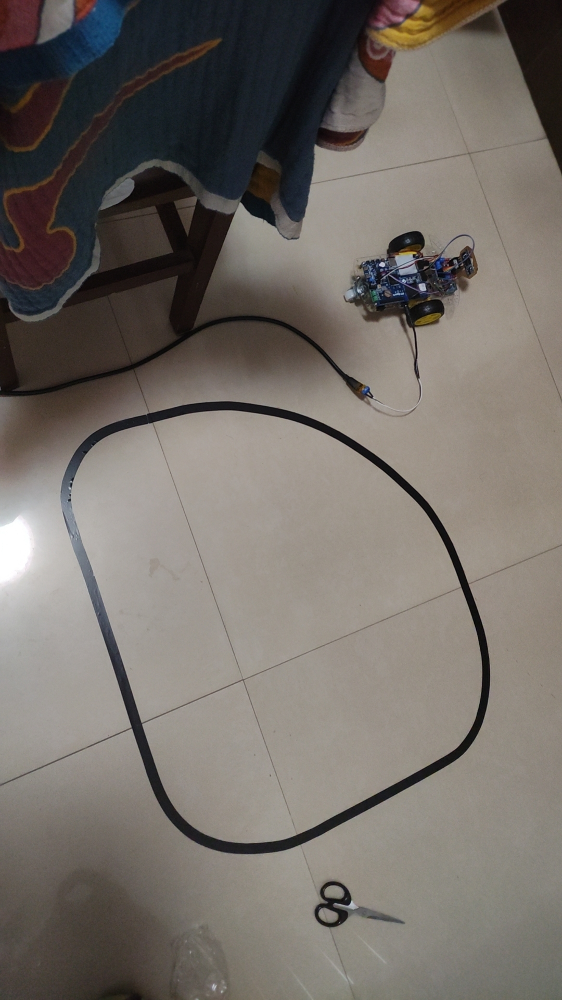


